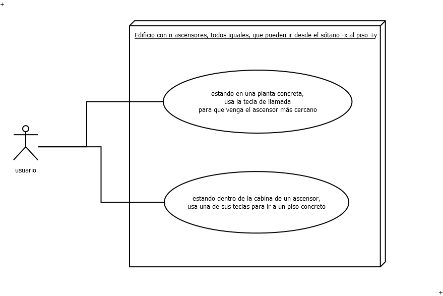
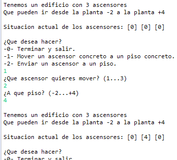
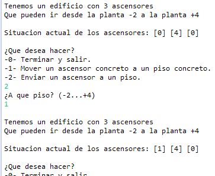
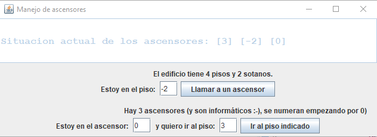

# Introduccion

# Tareas a realizar

Implementar el programa según lo puedas interpretar a partir de esta información:

Caso de uso:

Sugerencia de interfaz de usuario textual:

# Tareas extendidas (opcionales)

Implementar lo mismo, pero usando un interfaz gráfico:

nota: Si los módulos o clases se han implementado bien, separando adecuadamente el modelo (la funcionalidad) y el interfaz de usuario. Se podria aprovechar completamente el modelo sin modificarlo nada. Solo habria que implementar un nuevo interfaz para usarlo.

