# Introduccion

Se trata de realizar una serie de pequeños programas para practicar con los controles más habituales en los interfaces gráficos.

# Tareas a realizar

## Hello, Benzirpi.

Algo sencillo para empezar: un texbox donde teclear un nombre y un botón que rellena otro textbox (de solo lectura) con un saludo a ese nombre.

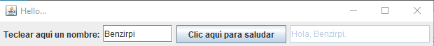

## Bocatas

Algo sencillo para elegir opciones: unos cuantos radiobuttons y checkboxes.

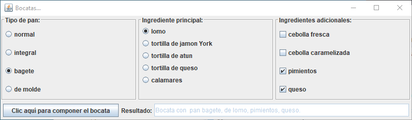

## Selección plana

Algo sencillo para elegir un elemento de una lista desplegable o de una lista abierta.

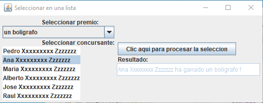

## Diálogos estándares

Manejo de los diálogos del sistema operativo para: seleccionar carpetas, seleccionar archivos, seleccionar colores,...

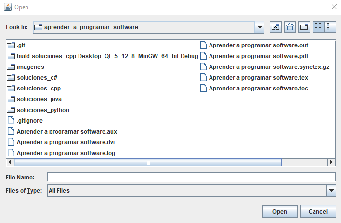

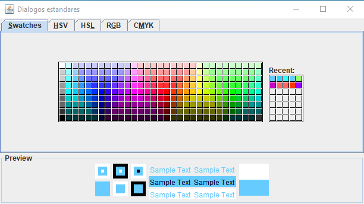

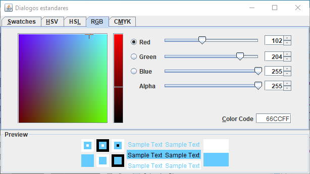

## Scroll

Cuando se ha de mostrar un contenido que no cabe en el espacio disponible, se puede recurrir a unos deslizadores (scrollbars) horizontales o verticales para permitir desplazar dicho contenido dentro del espacio disponible.

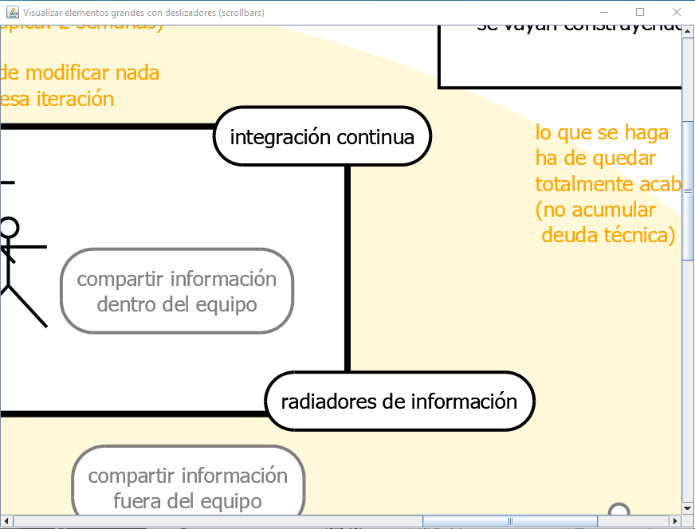

## Split

Cuando se desea permitir al usuario modificar sobre la marcha el espacio dedicado dentro de la ventana a los componentes dentro de ella, se puede recurrir a un separador ajustable entre zonas (spliter).

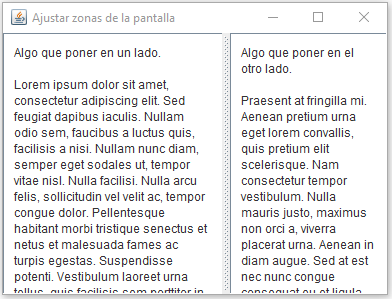

## Calendario

Pedir una fecha mostrando un calendario.

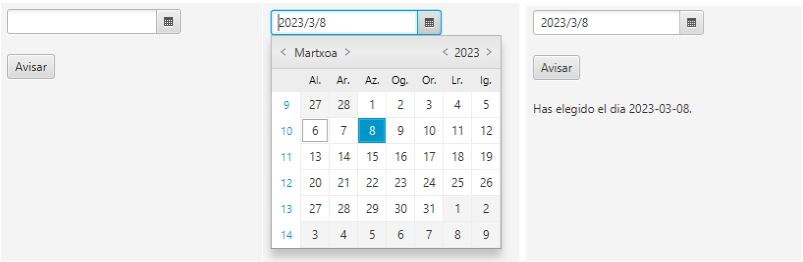

## Selección arbórea

Presentar elementos con estructura jerárquica en árbol, navegar a través de ella mostrando u ocultando ramas, seleccionar algún elemento, y hacer algo con él (por ejemplo, mostrar información detallada de ese elemento concreto).

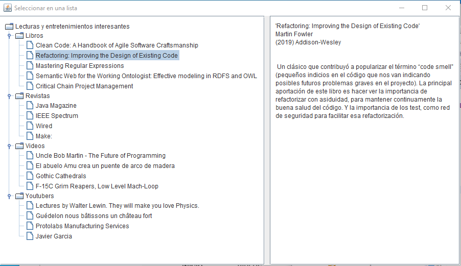

## Barra de progreso

Cuando se desencadena una tarea larga, es conveniente mantener al usuario informado de cómo va progresando dicha tarea. Así se evita dar la impresión que el sistema se ha colgado.

nota: No suele ser sencillo. Se ha de recurrir a la multitarea para conseguir que el interfaz de usuario (main thread) se vaya refrescando periódicamente mientras se está ejecutando la tarea (worker thread). Pero es algo tan necesario que casi todos los entornos de programación cuentan con algún mecanismo específico para implementar esa comunicación periódica.

Una sugerencia de ejercicio para practicar:

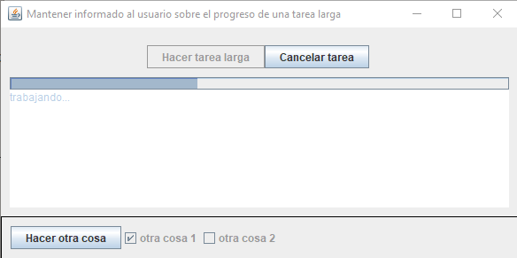

Una lectura interesante: [swingworker](https://www.oracle.com/technical-resources/articles/javase/swingworker.html)

# Tareas extendidas (opcionales)

## Internacionalización (i18n) y localización (L10n)

- Internacionalización (i18n) son los mecanismos para adaptar el software a distintos idiomas y países.

- Localización (L10n) son los mecanismos para adaptar el software a los distintos usos y costumbres de cada país: moneda, pesos y medidas, formatos numéricos, unidades de medida, formatos de fecha/hora, convenciones culturales, sentido de escritura,\ldots

Ambos dos son aspectos muy importantes para cualquier software que no sea algo pequeño ``de andar por casa''. Y, aún en estos, hay que tener en cuenta que muchas veces crecen y acaban desplegándose por multitud de sitios a donde no se había previsto que llegaran.

Tanto la internacionalización como la localización son prácticamente imposibles de implementar ``a posteriori''. Es decir, han de ser incorporados desde el primer momento; desde la primera línea de código que se escriba.

Merece la pena conocer y sentimos cómodos con los mecanismos que tenga nuestra plataforma para facilitar esos aspectos. Así los podremos utilizar en todos nuestros trabajos. 

Aunque al principio momento estemos pensando en un solo idioma y un solo país. Por un poco más de esfuerzo, si la plataforma dispone de ellos, merece poner en marcha esos mecanismos i18n y L10n. Así, si mas tarde se han de incorporar más idiomas o más países, el camino estará preparado.

## Ayudas y documentación

Es importante conocer los mecanismos que tenga nuestra plataforma para mostrar documentación de forma dinámica: 

- Tooltips: indicaciones de ayuda al poner el ratón un tiempo quieto sobre un determinado elemento. 

- Ayuda, tecla F1: para mostrar un manual de uso.

- Pop-ups: advertencias directas en algunos aspectos especialmente delicados. 

-  etc.

Esta documentación dinámica es importante en programas de una cierta envergadura; programas que vayan a ser usados por muchas personas distintas, a lo largo de mucho tiempo.

### Algunas recomendaciones

Creo que es mejor no incordiar mucho a los usuarios en su día a día. 

- Los tooltips han de ser cortos y precisos, describiendo cláramente lo que hace cada parte del interface. Y han de aparecer solo si el usuario deja manifiestamente el ratón quieto durante unos 2 segundos o más sobre algo. 

- El manual de usuario ha de ser accesible con facilidad. Habitualmente desde un menú o botón de 'Ayuda' bien visible desde cualquier punto del programa.

- Los pop-ups se han de reservar para temas realmente peligrosos. Es contraproducente estar continuamente preguntando al usuario si "está seguro de...". Y, cuando se pregunta, hay que ofrecer toda la información relevante. Por ejemplo en lugar de preguntas genéricas de "¿Está seguro de borrar el expediente?", mejor detallar "¿Está seguro de BORRAR el expediente XXXX-YY-ZZZZ de xxxxxxx, referente a xxxxxxxxxxxxx?"

Respecto al manual de usuario. Comentar que casi nadie suele leerlo, es verdad. Ni aún en el caso de que esté bien redactado, sea claro y sea ameno. Pero aún así, creo que merece la pena dotar a nuestros programas de una buena documentación de usuario. 

Al escribir un manual, suele ser conveniente enfocarlo como un curso de autoestudio. Un curso que explique la filosofia de funcionamiento del programa y los conceptos principales involucrados en su manejo. De tal manera que permita entender las pantallas y los flujos de trabajo al comenzar a trabajar.

Si, además, se le dota de un buen índice de temas. Ese manual podrá ser utilizado también, en cierta medida, como referencia puntual para resolver dudas.

Lo que jamás de los jamases hay que hacer es escribir una mera recopilación de pantallas,... citando menú por menú y botón a botón,... solo por cumplir el expediente,...  
¡No merece la pena!. Además de resultar inútiles, ese tipo de manuales son los que dan tan mala fama a los manuales de usuario.

